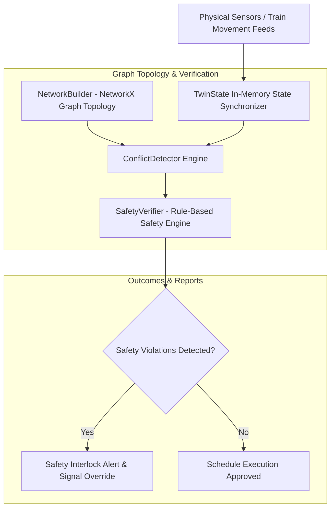

# RailwayTwin — Digital Twin Railway Safety Verifier

> **Status**: 🔵 Completed Prototype  
> **Target Identity**: RailwayTwin  
> **License**: MIT License ([LICENSE](LICENSE))  

RailwayTwin is a digital twin railway simulation and safety verification platform built with **Python**, **NetworkX**, and **NumPy**, designed to detect track allocation conflicts, enforce overspeed constraints, and verify safety invariants in rail networks.

---

## Overview

Railway networks require real-time verification to prevent train collisions, overspeed violations, and signal deadlocks. **RailwayTwin** creates an in-memory digital twin model of physical track topologies, monitoring train speeds, locations, and route allocations to evaluate safety invariants deterministically before executing physical signals.

---

## Why I Built It

I built RailwayTwin to explore digital twin modeling, graph topology representation, and formal safety verification. Developing RailwayTwin involved engineering a dual-representation model: a discrete graph for topological connectivity (`NetworkBuilder`) and a dynamic state container (`TwinState`) evaluated by rule-based safety checkers (`ConflictDetector` and `SafetyVerifier`).

---

## Architecture & Data Flow



For supplemental optimization notes, see [`docs/OPTIMIZATION_GUIDE.md`](docs/OPTIMIZATION_GUIDE.md).

---

## Key Features & Systems Design

- **Digital Twin State Synchronizer**: `TwinState` maintains live track allocations, speeds, and train position vectors.
- **Track & Signal Conflict Detector**: `ConflictDetector` identifies double-allocation anomalies and route overlaps.
- **Speed Limit & Safety Invariant Verifier**: `SafetyVerifier` checks train velocity against track speed ceilings to prevent overspeed risk.
- **Graph Network Topology Builder**: `NetworkBuilder` constructs railway node-and-edge graphs for path calculation.
- **Optimized Data Pipeline**: Transformed 80MB raw schedule logs into a 32MB structured CSV format (`data/processed_schedules.csv`) for fast local ingestion.

---

## Technical Stack

| Domain | Technologies |
|---|---|
| **Core Framework** | Python 3.10+, NetworkX, NumPy |
| **Data Processing** | Pandas, CSV data transformations |
| **Testing & Quality** | Python standard `unittest` framework |

---

## Repository Structure

```
digital_twin_railway_safety_verifier/
├── data/
│   └── processed_schedules.csv   # Optimized 32MB railway schedule dataset
├── docs/
│   ├── OPTIMIZATION_GUIDE.md     # Data processing & memory optimization guide
│   ├── PROJECT_SUMMARY.md        # Architecture overview
│   └── QUICKSTART.md             # Execution instructions
├── src/
│   ├── digital_twin/             # Twin state, conflict detector, & safety verifier
│   └── network/                  # Graph topology builder
├── tests/
│   ├── test_digital_twin.py      # Core state & network unit tests
│   └── test_safety_conflicts.py  # Overspeed & conflict edge case unit tests
├── LICENSE                       # MIT License
└── README.md                     # Project documentation
```

---

## Installation & Setup

### Prerequisites
- Python 3.10+

### Setup Virtual Environment

```bash
# Clone repository
git clone https://github.com/Balu-Annapureddy/digital_twin_railway_safety_verifier.git
cd digital_twin_railway_safety_verifier

# Create virtual environment
python -m venv .venv

# Activate virtual environment
# Windows (PowerShell):
.\.venv\Scripts\Activate.ps1
# Linux/macOS:
# source .venv/bin/activate

# Install dependencies
pip install networkx numpy pandas
```

---

## Testing

Automated unit tests are located in `tests/` (8 unit tests covering state synchronization, track conflict detection, overspeed verification, and graph topology building).

Run the test suite using Python's built-in `unittest`:

```bash
.\.venv\Scripts\python.exe -m unittest discover tests
```

---

## Security Audit Notice

An audit of source files found no obvious hardcoded credentials. Configuration files use local environment parameters.

---

## Limitations

- **Simulation Boundary**: Operates as a deterministic safety verification prototype; production railway deployment requires integration with hardware SCADA / ETCS signaling systems.

---

## License

This project is licensed under the MIT License — see the [`LICENSE`](LICENSE) file for details.
