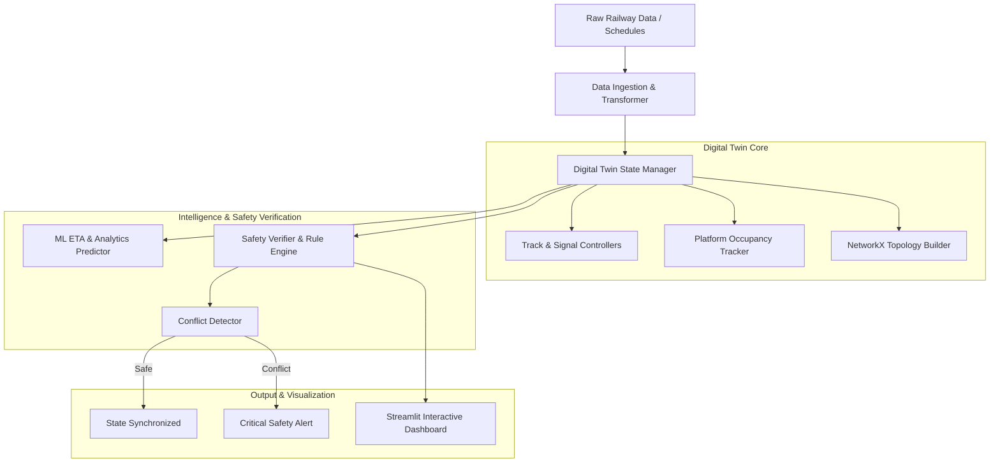

# RailwayTwin — Digital Twin for Railway Simulation & Safety Verification

> **Status**: 🔵 Completed / Portfolio Maintained  
> **Target Identity**: RailwayTwin  
> **License**: MIT License ([LICENSE](LICENSE))  

RailwayTwin is a digital twin simulation, analytics, and deterministic safety verification engine designed to model railway network topology, train schedules, track occupancy, and signal/gate states to prevent operational conflicts.

---

## Overview

Modern railway management requires validating operational decisions before issuing signal updates or dispatching trains. **RailwayTwin** explores a core safety question: **Can a digital twin simulate, inspect, and deterministically check railway operational states before a physical dispatch decision is executed?**

The platform decouples predictive machine learning (ETA prediction, delay modeling) from deterministic safety verification (track collision detection, signal state rules, gate interlocks). Operational actions must pass pre-execution safety verification regardless of ML predictions.

---

## Why I Built It

I built RailwayTwin to explore safety-critical systems engineering, digital twin modeling, network graph analysis, and data engineering. Handling large Indian Railways schedule datasets required optimizing data pipelines (reducing schedule file footprint from 80 MB JSON to 32 MB CSV) while enforcing zero-collision safety rules across track segments and platform allocations.

---

## Architecture & Data Flow



For detailed architectural notes, see [`docs/PROJECT_REPORT.md`](docs/PROJECT_REPORT.md) and [`docs/USER_GUIDE.md`](docs/USER_GUIDE.md).

---

## Key Features & Systems Design

- **Digital Twin State Synchronization**: Manages live twin state (`TwinState`) tracking active trains, speeds, track occupancy, signal aspects, and level crossing gate states.
- **Deterministic Safety Verification**: `SafetyVerifier` evaluates track allocation rules, signal interlocks, and gate opening parameters prior to state commitment.
- **Conflict Detection Engine**: `ConflictDetector` performs spatial and temporal checks to identify overlapping track allocations and route conflicts.
- **Network Topology Builder**: Constructs NetworkX graph representations (`NetworkBuilder`) from station coordinates and route distances for graph analytics.
- **ML Analytics & ETA Prediction**: Integrates `scikit-learn` regression models for train arrival time estimation and schedule delay analysis.
- **Data Pipeline Optimization**: Converted legacy 80 MB schedule JSON files into a 32 MB binary/CSV format, significantly speeding up dataset loading times.
- **Interactive Dashboard**: Streamlit interface (`dashboard/app.py`) providing geospatial network maps, station inspection, and event timelines.

---

## Technical Stack

| Domain | Technologies |
|---|---|
| **Core & Twin Model** | Python 3.10+, `numpy`, `pandas`, `polars` |
| **Network & Graph Analysis** | `networkx` |
| **Machine Learning** | `scikit-learn` |
| **Visualization & Dashboard** | Streamlit, Plotly, Matplotlib |
| **Testing & Verification** | Python standard `unittest`, `pytest` |

---

## Repository Structure

```
digital_twin_railway_safety_verifier/
├── config/
│   ├── safety_rules.py        # Deterministic safety rules & validation functions
│   ├── settings.py            # Global application settings
│   └── station_config.py      # Station layout metadata
├── dashboard/
│   ├── app.py                 # Main Streamlit dashboard application
│   └── components/            # Visual map & simulation UI components
├── data/
│   ├── sample_indian_railways.csv
│   └── sample_network_topology.json
├── docs/
│   ├── development_log.md     # Development history
│   ├── OPTIMIZATION_GUIDE.md  # Data engineering & optimization benchmarks
│   ├── PROJECT_REPORT.md      # Comprehensive technical report
│   ├── PROJECT_SUMMARY.md     # Project summary
│   ├── QUICKSTART.md          # Additional setup guide
│   └── USER_GUIDE.md          # User operational guide
├── src/
│   ├── ai/                    # ML model trainers & ETA predictor
│   ├── digital_twin/          # Core twin state, verifier, & conflict detector
│   ├── intelligence/          # Data transformers & dataset analyzers
│   ├── logging/               # Event logger
│   ├── network/               # NetworkX topology builder
│   ├── railway/               # Track, signal, platform, & gate controllers
│   ├── simulation/            # Train movement & operational simulator
│   └── utils/                 # Occupancy calculators & categorizers
├── tests/
│   └── test_digital_twin.py   # Automated unit test suite (5 core tests)
├── convert_schedules_to_csv.py# Data transformation script
├── LICENSE                    # MIT License
└── requirements.txt           # Dependency requirements
```

---

## Installation & Setup

### Prerequisites
- Python 3.10+

### Setup Virtual Environment

```bash
# Clone repository
git clone https://github.com/Balu-Annapureddy/digital_twin_railway_safety_verifier.git
cd digital_twin_railway_safety_verifier

# Create virtual environment
python -m venv .venv

# Activate virtual environment
# Windows (PowerShell):
.\.venv\Scripts\Activate.ps1
# Linux/macOS:
# source .venv/bin/activate

# Install dependencies
pip install -r requirements.txt
```

---

## Usage

Launch the interactive Streamlit dashboard:

```bash
streamlit run dashboard/app.py
```

The web dashboard will automatically open at `http://localhost:8501`.

---

## Testing

Automated tests are located in `tests/test_digital_twin.py` (5 unit tests covering twin state synchronization, conflict detection, safety verifier, and network topology builder).

Run the test suite:

```bash
.\.venv\Scripts\python.exe -m unittest discover tests
```

---

## Limitations

- **Prototype Scope**: Designed as an academic/engineering research prototype using synthetic and sample schedule data; not intended for real-world railway dispatching hardware.
- **Simulation Granularity**: Train physics modeled via discrete velocity-distance steps rather than continuous multi-body mechanical simulation.

---

## License

This project is licensed under the MIT License — see the [`LICENSE`](LICENSE) file for details.
